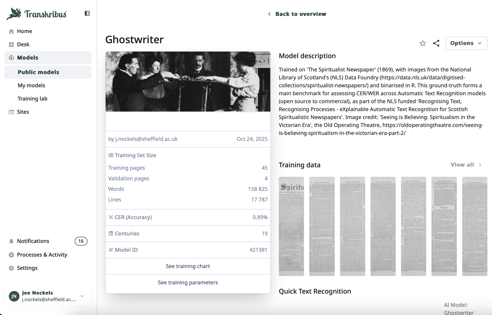

# Recognising_Text_Recognising_Processes

This repository provides access to a set of Optical Character Recognition (OCR) and Automatic Text Recognition (ATR) walkthroughs, conducted as zero-shot experiments on *The Spiritualist Newspaper* (1869), held by the [National Library of Scotland's Data Foundry](https://data.nls.uk/data/digitised-collections/spiritualist-newspapers/). These experiments represent a range of providers, with their eventual Character Error Rates (CERs) calculated through Haveral's external, and open source, tool [CERberus](https://github.com/WHaverals/CERberus). For more information about this project, its funding and methodology, please see the *Recognising Text, Recognising Processes* [homepage](https://www.dhi.ac.uk/recognising-text).

The requirements and apt files enable you to run your own tests via MyBinder, through [this link](https://mybinder.org/v2/gh/jnockels-sys/Recognising_Text_Recognising_Processes/main). You can run cells, edit the code freely, without changing the main repository and generate your own outputs. 

Bear in mind that you will need to download *The Spiritualist* images locally, which can be directly downloaded from the [National Library of Scotland's Hugging Face repository](https://huggingface.co/datasets/NationalLibraryOfScotland/Spiritualist_Newspaper), alongside our reference transcription manually corrected within Transkribus and generated using the trained [*Ghostwriter* model](https://www.transkribus.org/models/ghostwriter). 

You will also need a Anthropic API key to run the Claude Sonnet 4.5 test. Large packages, for instance SuryaOCR's Detection or Foundation Model will likely run slower through MyBinder than if using Jupyter Notebooks locally. It should be said, therefore, that these files can also be downloaded as separate .ipynb resources and ran locally. 

We thank Dr Sarah Ames, Digital Scholarship Librarian at the National Library of Scotland, for her support, as well as Jamie McLaughlin, Senior Research Software Engineer at the University of Sheffield's Digital Humanities Institute. 

Citation - 

@misc{name_of_notebook,
  title={Recognising Texts, Recognising Processes},
  author={Joe Nockels},
  year={2026},
  url={mybinder_url}
}
